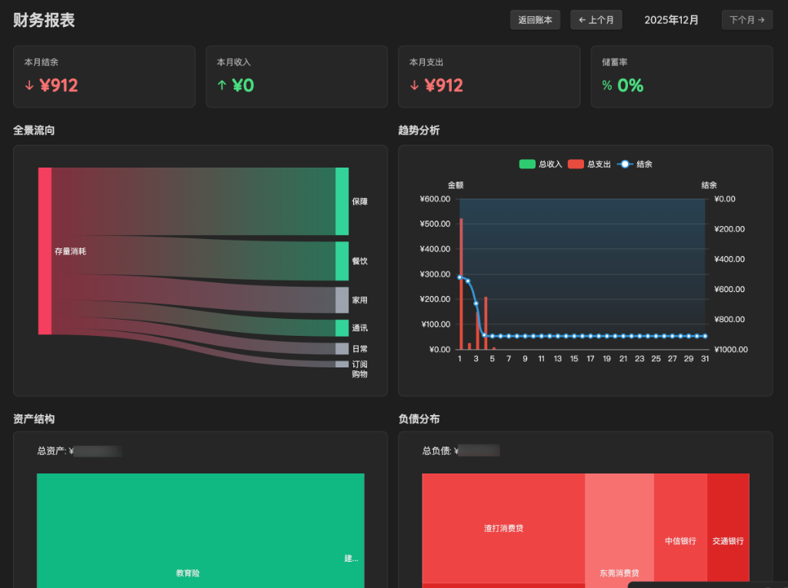
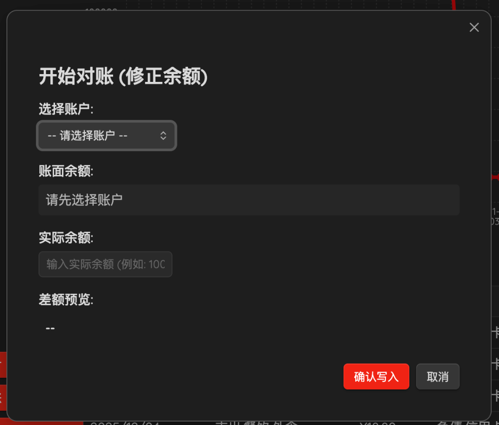
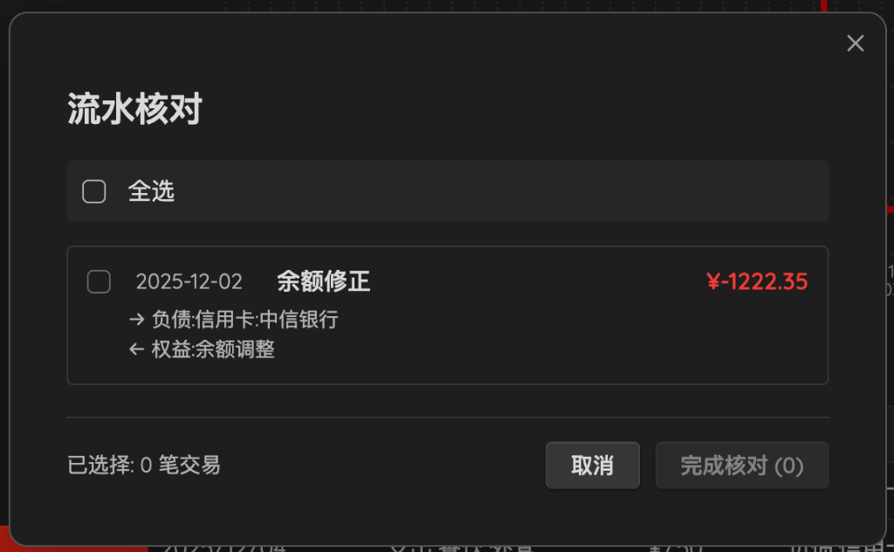

# Ledger for Obsidian (账本插件)

> **专业的 Obsidian 纯文本记账插件**  
> 将财务数据安全地保存在您自己的仓库中，保护隐私，完全可控。

[](https://github.com/Elo-Mario/ledger-obsidian/releases)
[](LICENSE)

在 Obsidian 中轻松管理个人财务！所有数据以纯文本格式存储，与支持 [Ledger CLI](https://www.ledger-cli.org) 的任何工具无缝互操作。告别那些出售用户数据的在线记账网站，将财务信息安全地存储在您的 Obsidian 库中。

---

## ✨ 新特性亮点 (v0.4.8)

### 📊 **交互式财务报表**
全新的可视化报表系统，帮助您全面了解财务状况：

- **全景资金流向图 (Sankey)**  
  直观展示 **收入 → 资产 → 支出** 的完整资金流动路径，清晰呈现每一笔钱的来龙去脉
  
- **资产/负债结构图 (Treemap)**  
  双矩形树图并排展示资产（绿色）与负债（红色）的详细构成，一目了然掌握财务结构
  
- **趋势分析图表**  
  追踪日/周/月维度的收支趋势和累计净资产变化
  
- **主题完美适配**  
  图表自动适应 Obsidian 的浅色/深色主题，无缝融入您的工作环境

> 💡 **使用提示**: 在仪表板点击"财务报表"按钮，或使用命令面板搜索"财务报表"

### ⚖️ **智能对账向导**
新增"开始对账"功能，轻松修正账面余额：

- **一键修正差额**: 输入实际余额，系统自动计算并生成修正交易
- **实时预览**: 动态显示账面余额与实际余额的差额
- **自动写入**: 无需手工编辑 Ledger 文件，点击确认即可完成修正

> 💡 **使用场景**: 对账时发现账面余额与银行 APP 显示的余额不一致？使用"开始对账"功能即可轻松修正！

---

## 🎯 核心功能

### 💰 快捷记账
- **移动端友好**: 配合 Obsidian 移动版，随时随地记录支出
- **智能建议**: 自动建议历史账户和支出项目，加速输入
- **协议支持**: Obsidian 协议 `obsidian://ledger` 支持，可创建桌面/主屏幕快捷方式

### ✅ 流水核对
- 快速查看未核对交易
- 一键批量核对多笔流水
- 自动为交易日期添加 `*` 标记

### 📈 数据可视化
- 账户余额图表
- 收支趋势分析
- 净资产变化追踪
- 交互式悬停提示

---

## 📥 安装

### 方式一：从 Obsidian 社区插件安装（推荐）
1. 打开 **设置 → 社区插件**
2. 搜索 **"Ledger"**
3. 点击 **安装** → **启用**

### 方式二：手动安装
1. 从 [GitHub Releases](https://github.com/Elo-Mario/ledger-obsidian/releases) 下载最新版本
2. 解压 `main.js`、`manifest.json` 到 `.obsidian/plugins/ledger-obsidian/`
3. 重新加载 Obsidian 并启用插件

---

## ⚙️ 配置指南

### 必需设置

#### 1. 启用图表功能
在插件设置中**必须勾选"启用图表"**，才能查看财务报表。

#### 2. 设置账本文件路径
指定主 Ledger 文件的路径（例如：`finance/transactions.ledger`）

### Ledger 文件格式说明

本插件支持标准 Ledger 格式，并完美支持中文：

```ledger
; 别名定义（可选）
alias a=Assets
alias e=Expenses
alias i=Income

; 已核对交易（日期后有 * 标记）
2025-01-01 * 工资收入
    Assets:银行:工资卡             ¥10,000.00
    Income:工资                   -¥10,000.00

; 未核对交易（日期后无 * 标记）
2025-01-02 超市购物
    Expenses:食品:日用品           ¥123.45
    Assets:银行:工资卡            -¥123.45

2025-01-03 * 餐饮支出
    Expenses:餐饮:午餐             ¥45.00
    Assets:支付宝                 -¥45.00
```

**格式要点：**
- ✅ 完全支持中文账户名称
- ✅ 使用 `¥`、`$`、`€` 等符号表示金额
- ✅ 账户名称与金额之间使用**至少 2 个空格**分隔
- ✅ 日期后的 `*` 表示该交易已核对
- ✅ 以 `;` 开头的行为注释

---

## 📖 使用指南

### 可用命令

在 Obsidian 命令面板（`Ctrl/Cmd + P`）中可以访问以下命令：

| 命令 | 说明 | v0.4.8 |
|-----|-----|--------|
| **记一笔** | 快速添加新交易 | |
| **打开 Ledger 面板** | 查看账户余额和交易历史 | |
| **财务报表** | 查看可视化图表和深度分析 | ⭐ 增强 |
| **开始对账** | 修正账面与实际余额的差异 | 🆕 新增 |
| **流水核对** | 批量标记交易为已核对状态 | |

### 侧边栏快捷按钮

在 Ledger 仪表板的侧边栏，您可以找到以下快捷按钮：
- **流水核对**: 打开核对界面
- **开始对账**: 打开余额修正向导
- **财务报表**: 打开可视化报表

---

## 📸 功能展示

### 💰 财务报表

> 一站式可视化展示：桑基图展示资金流、树图展示结构、趋势图展示变化

### ⚖️ 开始对账

> 输入实际余额，自动计算差额并生成修正交易

### ✅ 流水核对

> 批量核对交易，一键添加已核对标记

### 📊 账本仪表板

> 清晰的账户余额和交易列表视图

### ➕ 添加交易

> 快速记账表单，支持智能建议

### 📱 移动端支持

> 在手机上也能轻松记账

---

## 🆕 更新日志

### v0.4.8 (2025-12-05)

#### 🎉 新增功能
- **开始对账功能**:
  - ⚖️ 全新的余额修正向导
  - 🔢 自动计算账面与实际余额的差额
  - ✏️ 一键生成修正交易并写入 Ledger 文件
  - 🎨 实时差额预览，正值绿色、负值红色

#### 📊 增强功能
- **财务报表优化**:
  - 🌈 提升图表颜色对比度，文字更清晰
  - 🎨 优化 UI 细节和布局
  - 🔧 改进主题切换的响应速度

#### 🐛 Bug 修复
- 清理所有调试日志，提升性能
- 优化代码结构，提高稳定性

### v0.4.7 (2025-12-02)
- **桑基图重构**: 新增"结余"和"存量消耗"节点，确保会计配平
- **视觉优化**: 节点和连线按金额降序排列
- **修复**: 修复零收入场景的显示问题和 Moment.js 警告

### v0.4.6 (2025-12-02)
- **文案优化**: 统一"对账"术语为"流水核对"
- **代码质量**: 清理冗余代码，修复 TypeScript 类型错误

### v0.4.5 (2025-11-28)
- **流水核对功能**: 批量核对交易，自动添加 `*` 标记
- **财务报表功能**: 初版发布，支持多种图表和趋势分析

---

## 🔧 技术细节

### 技术栈
- **React 17** + **TypeScript** - 组件开发
- **ECharts 6.0** - 专业图表渲染
- **styled-components 5.3** - CSS-in-JS 样式方案
- **Nearley Parser** - Ledger 文件语法解析
- **Moment.js** - 日期处理

### 浏览器兼容性
- ✅ **桌面端**: Windows、macOS、Linux
- ✅ **移动端**: iOS、Android（需 Obsidian 移动应用）

### 数据格式
- 完全兼容 [Ledger CLI](https://www.ledger-cli.org) 格式
- 支持与其他纯文本记账工具互操作

---

## 📚 延伸阅读

想了解更多关于纯文本记账的知识？

- [Ledger CLI 官方文档](https://www.ledger-cli.org/3.0/doc/ledger3.html)
- [纯文本记账 (Plain Text Accounting)](https://plaintextaccounting.org)
- [复式记账原理](https://www.ledger-cli.org/3.0/doc/ledger3.html#Principles-of-Accounting-with-Ledger)

---

## 🤝 贡献

欢迎各种形式的贡献！

- 🐛 **报告 Bug**: [提交 Issue](https://github.com/Elo-Mario/ledger-obsidian/issues)
- 💡 **功能建议**: [发起讨论](https://github.com/Elo-Mario/ledger-obsidian/discussions)
- 🔧 **代码贡献**: [提交 Pull Request](https://github.com/Elo-Mario/ledger-obsidian/pulls)

---

## 📝 许可证

本项目采用 **GPL-3.0 许可证** - 详见 [LICENSE](LICENSE) 文件

---

## 👤 作者

**Elo-Mario**
- GitHub: [@Elo-Mario](https://github.com/Elo-Mario)
- 项目主页: [ledger-obsidian](https://github.com/Elo-Mario/ledger-obsidian)

---

<div align="center">

**⭐ 觉得有帮助？请在 GitHub 上给个星标支持一下！⭐**

[Star this repo](https://github.com/Elo-Mario/ledger-obsidian) · [Report Bug](https://github.com/Elo-Mario/ledger-obsidian/issues) · [Request Feature](https://github.com/Elo-Mario/ledger-obsidian/discussions)

</div>